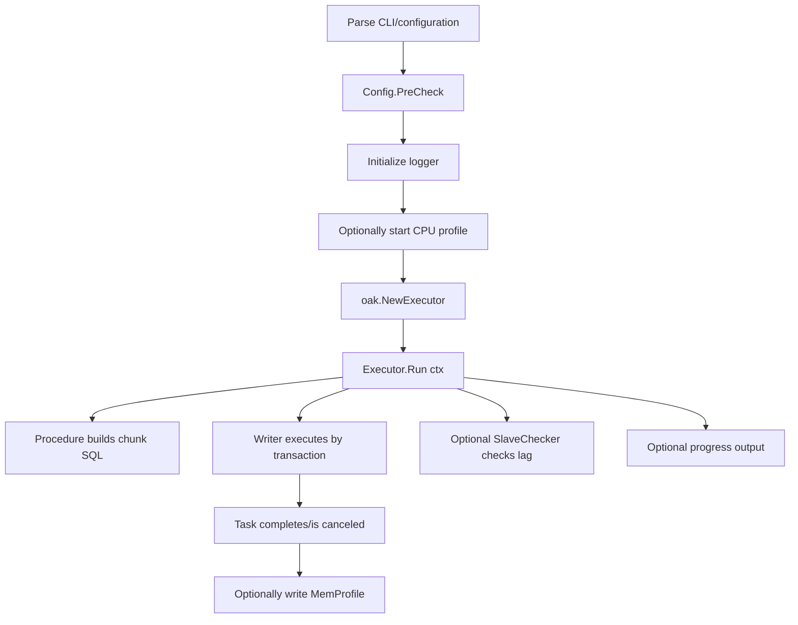

# go-oak-chunk CLI User Guide (v3)

[English](cli-usage-en.md) | [简体中文](cli-usage.md)

## 1. Document scope

This document explains how to use `go-oak-chunk` from the **CLI** to execute chunked DML on large tables.

It covers:

- Installation and startup
- Detailed `run` subcommand options
- Configuration-file syntax and option mapping
- Execution flow and rate/replica-lag control
- Performance tuning recommendations
- Common errors and troubleshooting

---

## 2. Capabilities

The core CLI capabilities of `go-oak-chunk` are:

- Supports only single-statement `UPDATE` / `DELETE`, executed in chunks
- Advances with a primary or unique key to avoid full-table-scan batch processing
- Data-source-specific DELETE acceleration:
  - **OceanBase**: two-phase covering-index fast path (`--select-order-by`), optionally extended with **partition concurrency** (`--partition-concurrency`)
  - **TiDB**: chunking by the hidden row handle `_tidb_rowid` (`--tidb-rowid`), supporting **NONCLUSTERED** tables without a primary or unique key
- Unified rate limiting and guardrails: token bucket (`--sleep`) + global row rate (`--rows-per-sec`) + replica-lag awareness (`--max-lag`); stop when `--max-rows` / `--max-duration-ms` is reached
- NOW() freezing for long-running jobs and classified retries for failures, including OB/TiDB-specific error codes
- Runtime progress output
- Graceful `SIGINT/SIGTERM` handling, `--dry-run` preview, and EXPLAIN preflight checks for large tables
- CPU and memory profile output

---

## 3. Quick start

### 3.1 Build the binary

```bash
make build
```

This generates `goc` by default, as configured by `BINARY_NAME` in the `Makefile`.

### 3.2 Check the version

```bash
./goc version
```

### 3.3 View help

```bash
./goc --help
./goc run --help
```

If you do not want to build first, run:

```bash
go run ./cmd/go-oak-chunk run --help
```

---

## 4. Command structure

- Root command: `go-oak-chunk` (usually built as `goc`)
- Subcommands:
  - `run`: execute chunked DML
  - `version`: print version information (application version, Go version, build time, and Git information)

---

## 5. `run` options in CLI mode

> If you pass `--config`, most business options are read from the configuration file. The options in this section are still useful as a reference.

| Option | Type/default | Required | Description | Important notes |
|---|---|---|---|---|
| `-c, --config` | string / empty | No | TOML configuration-file path | Enables configuration-file mode |
| `--cpuprofile` | string / empty | No | Output CPU profile file | Enabled when the run starts |
| `--memprofile` | string / empty | No | Output memory profile file | Written after the task finishes |
| `--chunk-size` | int64 / `1000` | No | Rows processed per chunk | `0` means one operation; `1` means one row at a time |
| `-e, --execute` | string / empty | Yes | SQL to execute | Must be a single `UPDATE/DELETE` statement and should contain `WHERE` |
| `--force-chunking-column` | string / empty | No | Force the chunk-key columns | Must exactly match a primary/unique-key column set; OB also validates with `SHOW INDEX` |
| `-H, --host` | string / `localhost` | No | MySQL host | |
| `-P, --port` | int / `3306` | No | MySQL port | |
| `-u, --user` | string / `root` | No | MySQL user | |
| `-p, --password` | string / empty | No | MySQL password | |
| `-d, --database` | string / empty | **Yes (current implementation)** | Target database name | The help text says it can be omitted for a fully qualified table, but the current implementation still requires it |
| `--txn-size` | int64 / `1000` | No | Maximum rows per transaction | Controls transaction size |
| `--sleep` | int64 / `0` | No | Sleep between chunks (milliseconds) | Unit is **milliseconds** |
| `--noConsiderLag` | bool / `false` | No | Whether to ignore lag-based sleep expansion | When `true`, sleep is not increased substantially |
| `--max-lag` | int64 / `0` | No | Replica-lag threshold (seconds) | When `>0`, reaching the threshold actively slows execution |
| `--include-slaves` | string / empty | No | Monitor only these replica IPs (comma-separated) | Mutually exclusive with `--exclude-slaves` |
| `--exclude-slaves` | string / empty | No | Exclude these replica IPs (comma-separated) | Mutually exclusive with `--include-slaves` |
| `--no-slaves` | bool / `false` | No | Skip replica-lag detection | Commonly used with TiDB/OceanBase |
| `--print-progress` | bool / `false` | No | Print progress to the console | Refreshes every 3 seconds |
| `--debug` | bool / `false` | No | Enable debug logging | |
| `--rows-per-sec` | int64 / `0` | No | Global rows-per-second cap | `0` means unlimited; combined with `--sleep`/`--max-lag` |
| `--select-order-by` | string / empty | No | Ordering columns for the two-phase candidate SELECT (comma-separated) | Enables the covering-index fast path (DELETE only); prerequisite for `--partition-concurrency` |
| `--select-index` | string / empty | No | `FORCE INDEX` name for the candidate SELECT | Requires `--select-order-by`; otherwise the optimizer chooses |
| `--select-cursor` | bool / `false` | No | Advance the candidate SELECT with a cursor instead of rescanning from the beginning | Requires `--select-order-by`; strongly recommended for large tables |
| `--max-rows` | int64 / `0` | No | Stop after processing the specified number of rows | `0` means unlimited; applies to range/covering/partition strategies |
| `--max-duration-ms` | int64 / `0` | No | Stop after the specified number of milliseconds | `0` means unlimited; applies to all three strategies |
| `--partition-concurrency` | int / `0` | No | OceanBase-only number of workers for partition-concurrent DELETE | `0/1` disables it; requires `--select-order-by` and a partitioned table |
| `--tidb-rowid` | bool / `false` | No | TiDB-only chunk DELETE by hidden `_tidb_rowid` | DELETE only; NONCLUSTERED table, no PK/UK required; mutually exclusive with covering fast path/partition concurrency/`--force-chunking-column` |
| `--dry-run` | bool / `false` | No | Print sample SQL without executing it | Preview the fast-path SELECT/DELETE shape |
| `--preflight-threshold` | int64 / `0` | No | EXPLAIN threshold for large-table confirmation | `0` uses the default `100000` |
| `--yes` | bool / `false` | No | Skip the large-table confirmation prompt | Recommended for SDK/non-interactive scenarios |

---

## 6. Configuration-file mode (recommended for production)

### 6.1 Start the tool

```bash
./goc run -c /path/to/example.toml
```

### 6.2 Option precedence

When `--config` is active:

- Business options come from TOML, such as chunk size, SQL, and connection information
- `--cpuprofile` / `--memprofile` remain controlled by the command line

In other words, configuration-file mode takes precedence.

### 6.3 TOML field mapping

| TOML field | CLI option | Description |
|---|---|---|
| `chunk_size` | `--chunk-size` | Chunk size |
| `execute_query` | `--execute` | SQL to execute |
| `forced_chunking_column` | `--force-chunking-column` | Forced chunk key; note the **forced** spelling |
| `host` | `--host` | Primary address |
| `port` | `--port` | Primary port |
| `database` | `--database` | Database name |
| `user` | `--user` | User |
| `password` | `--password` | Password |
| `print_progress` | `--print-progress` | Print progress |
| `sleep` | `--sleep` | Millisecond sleep |
| `no_consider_lag` | `--noConsiderLag` | Lag-handling strategy |
| `max_lag` | `--max-lag` | Replica-lag threshold |
| `include_slaves` | `--include-slaves` | Include only these replicas |
| `exclude_slaves` | `--exclude-slaves` | Exclude replicas |
| `no_slaves` | `--no-slaves` | Skip replica detection |
| `txn_size` | `--txn-size` | Transaction size |
| `debug_mode` | `--debug` | Debug mode |
| `rows_per_sec` | `--rows-per-sec` | Global rows-per-second cap (`0` = unlimited) |
| `select_order_by` | `--select-order-by` | Covering-index fast-path ordering columns (empty by default = disabled) |
| `select_index` | `--select-index` | `FORCE INDEX` name for the candidate SELECT (empty by default) |
| `select_cursor` | `--select-cursor` | Cursor advancement (default `false`; requires `select_order_by`) |
| `max_rows` | `--max-rows` | Stop after the row limit (`0` = unlimited) |
| `max_duration_ms` | `--max-duration-ms` | Stop after the time limit (`0` = unlimited) |
| `partition_concurrency` | `--partition-concurrency` | OceanBase partition worker count (`0/1` = disabled) |
| `tidb_rowid` | `--tidb-rowid` | TiDB chunk DELETE by `_tidb_rowid` (default `false`) |
| `dry_run` | `--dry-run` | Print sample SQL only (default `false`) |
| `preflight_threshold` | `--preflight-threshold` | Large-table confirmation threshold (`0` = default `100000`) |
| `auto_confirm` | `--yes` | Skip large-table confirmation (default `false`) |
| `correct` | No direct flag (internal correction value) | Recommended value: `50` |
| `no_log_bin` | Not exposed by the CLI yet | Field retained in the current version |

### 6.4 Recommended template

```toml
debug_mode = true
chunk_size = 1000
execute_query = "DELETE FROM my_table WHERE created_at < '2025-01-01 00:00:00'"
forced_chunking_column = ""

host = "127.0.0.1"
port = 3306
database = "test_db"
user = "root"
password = "xxx"

print_progress = true
sleep = 0
no_consider_lag = false
max_lag = 0
include_slaves = ""
exclude_slaves = ""
no_slaves = false

txn_size = 2000
correct = 50
```

---

## 7. SQL constraints and preflight validation

The CLI performs the following important checks at startup:

1. `chunk_size` must not be negative
2. `execute_query` must not be empty
3. `include_slaves` and `exclude_slaves` are mutually exclusive
4. `database` must be non-empty in the current implementation
5. The SQL must contain a single statement
6. The SQL type must be `UPDATE` or `DELETE`
7. The target table must exist
8. The target table must have a usable primary or unique key
9. If `forced_chunking_column` is set, it must exactly match a unique-key column set; spaces around commas are ignored automatically

---

## 8. Execution flow (from CLI to core)



---

## 9. Rate limiting and replica-lag control

### 9.0 How it works (two independent mechanisms)

Rate limiting consists of **two independent mechanisms**. Both take effect after each chunk is committed, and the final pace is determined by the stricter one.

**Mechanism A: sleep / replica-lag throttling (token bucket)** — controls **time pacing and replica protection**, using `sleep`, `max_lag`, `no_consider_lag`, and `correct`.

- **Token bucket**: 1 ms granularity (1 token = 1 ms; 1,000 tokens are generated per second). The token count is the number of milliseconds to wait.
- The `getStopTime` goroutine repeatedly calculates the number of tokens to wait and sends it to consumers through the `bucketNum` channel:
  1. Detect replica lag (`--no-slaves`, or no standard primary/replica topology, skips detection).
  2. If `lag >= max_lag`, push the sentinel `LagThreshold(-1)`, sleep for 800 ms, and tell consumers to **pause for about one second while replicas catch up**.
  3. Otherwise calculate token count from `sleep`/`lag`/`no_consider_lag`, add the correction `correct` (default 50; it grows while throttling and decays normally to absorb 1–5 ms timing errors), and send it.
  4. Sleep for **the previous chunk duration × 5/4** as an adaptive polling interval.
- **Consumers** (Writer / covering / partition strategies) take the latest `bucketNum` value without blocking before each chunk: `-1` pauses for about one second; `>0` waits `n` ms with `Bucket.Wait(n)`; `0` (with `sleep=0` and no lag) does not wait.

**Mechanism B: row-rate throttling (`rows-per-sec`)** — controls **row throughput**, independently of the token bucket (`task/rows_limiter.go`).

- After each chunk is deleted/updated, wait for `affected / rows_per_sec` seconds; `0` means unlimited; the context can cancel the wait, so SIGINT stops immediately.

With partition concurrency, both the token bucket and the rows-per-second limiter are **globally shared**, limiting the aggregate table rate. A replica-lag pause also pauses all workers together.

> Quick rule: use `--sleep` + `--max-lag` for batch pacing and replica protection; use `--rows-per-sec` to cap rows per second; disable all three to run at full speed.

### 9.1 Actual `sleep` behavior

- `sleep=0`: no active sleep
- `0 < sleep <= 1000`: usually a random wait in `[0, sleep)`
- `sleep > 1000`: usually a random wait in `[sleep-1000, sleep)`

### 9.2 `noConsiderLag`

- `true`: sleep is not expanded further by high lag (more “hard”)
- `false`: sleep is expanded according to lag (more conservative)

### 9.3 `max-lag`

When `max_lag > 0` and detected `lag >= max_lag`, execution actively slows down and waits for replicas to catch up.

### 9.4 `no-slaves`

- `--no-slaves=true`: completely skip replica-lag detection and follow only the sleep/token-bucket pace
- Suitable for environments without a standard primary/replica topology, such as TiDB/OceanBase

### 9.5 `rows-per-sec` (global row-rate cap)

In addition to the token bucket (`sleep`) and replica lag (`max-lag`), `--rows-per-sec` adds a **global per-row rate cap**:

- It means “maximum rows processed per second”; before each DML, the tool requests quota based on the current batch size and waits if quota is unavailable
- It combines with `--sleep`/`--max-lag`: all three can make the Writer wait, and the strictest determines the final pace
- `--rows-per-sec=0`: unlimited (default)
- The limiter is **globally shared**: in partition-concurrent mode, all workers use the same limiter, so it limits the **aggregate table rate**, not each worker's individual rate

> Full speed: with `--sleep 0 --rows-per-sec 0` (and no `--max-lag` trigger), there is no implicit waiting; covering-index/partition DELETE runs at the rate the database can sustain.
> (Versions before v3.2.0 had a bug where these paths waited by deleted-row count after every chunk, roughly 1 ms per row. Even with rate limiting disabled, throughput was reduced to about 1,000 rows/s; this has been fixed.)

---

## 9bis. Guardrails: max-rows / max-duration-ms

`--max-rows` and `--max-duration-ms` are “stop when enough” guardrails. Reaching either limit stops the task:

- `--max-rows=N`: stop after a total of `N` rows have been processed; `0` means unlimited
- `--max-duration-ms=T`: stop after `T` milliseconds; `0` means unlimited

> Earlier versions allowed these options only with the covering-index fast path (`--select-order-by`); that restriction has been removed.
> Range (ordinary chunking), covering (covering-index fast path), and partition (partition concurrency) strategies now all enforce both limits.

Stopping is **coarse-grained**, and the timing differs by path:

- Range path: check and stop at a transaction/chunk boundary (using `writer.GetRowAffects()` and the start time)
- Covering path: stop at a chunk boundary
- Partition path: reserve quota before DELETE and trim the batch to the remaining allowance; `--max-rows` is exact across workers (aggregate never exceeds the limit; see §12bis)

---

## 10. Stop semantics and exit behavior

The CLI stops gracefully on `SIGINT/SIGTERM`:

- Cancel the run context after receiving the signal
- Map the cancellation to `task.ErrExecutionStopped`
- Treat it as a “normal stop” in the `run` subcommand and return success rather than an error exit

This allows you to safely interrupt a task with `Ctrl+C` instead of force-killing the process.

---

## 11. Using profiles

### 11.1 CPU profile

```bash
./goc run ... --cpuprofile cpu.pprof
go tool pprof -http=:8080 cpu.pprof
```

### 11.2 Memory profile

```bash
./goc run ... --memprofile mem.pprof
go tool pprof -http=:8081 mem.pprof
```

---

## 12. Common command examples

### 12.1 Basic UPDATE

```bash
./goc run \
  -d test \
  -e "UPDATE mybenchx1 SET k = 1 WHERE created_at <= '2024-12-28 11:30:06'" \
  --chunk-size 1000 \
  --txn-size 2000 \
  -H 127.0.0.1 -P 3306 -u root -p 'xxx' \
  --print-progress
```

### 12.2 DELETE with replica-lag protection

```bash
./goc run \
  -d test \
  -e "DELETE FROM mybenchx0 WHERE created_at <= '2024-12-21 00:03:13'" \
  --chunk-size 1000 \
  --txn-size 2000 \
  --sleep 300 \
  --max-lag 3 \
  --include-slaves "10.0.0.12,10.0.0.13" \
  -H 127.0.0.1 -P 3306 -u root -p 'xxx' \
  --print-progress --debug
```

### 12.3 Use a configuration file

```bash
./goc run -c ./conf/example.toml --cpuprofile cpu.pprof --memprofile mem.pprof
```

### 12.4 TiDB/OceanBase-style environment (skip replica detection)

```bash
./goc run \
  -d test \
  -e "DELETE FROM t WHERE id > 1000000" \
  --no-slaves \
  --chunk-size 2000 \
  --txn-size 4000 \
  -H 127.0.0.1 -P 4000 -u root -p 'xxx'
```

> On OceanBase, the tool first obtains column definitions through compatibility DDL and then runs `SHOW INDEX` to discover primary/unique keys.
> Therefore, even if a global unique key is missing from the compatibility DDL, an explicit value such as `--force-chunking-column order_code` can still match the real unique index.

---

## 12bis. OceanBase partition-concurrent DELETE (`--partition-concurrency`)

This OceanBase-only acceleration runs the two-phase covering-index DELETE **in parallel by partition**.

### 12bis.1 Activation conditions

- The data source must be **OceanBase**
- The covering-index fast path must be enabled with `--select-order-by` (DELETE only)
- The target table must be **partitioned** (detected at runtime through `information_schema.PARTITIONS`)
- `--partition-concurrency >= 2` enables it; `0/1` falls back to a single-worker covering/range path

### 12bis.2 Concurrency behavior

- The worker count is clamped to `min(configured value, actual partition count, internal hard limit 64)`
- Each worker claims one partition name and owns its cursor; DELETE is scoped to `db.table PARTITION (name)`
- The connection-pool limit is automatically increased with concurrency (approximately `concurrency + 2`) to prevent workers from competing for connections
- The rate limiters (token bucket + `--rows-per-sec`) are **globally shared**: they limit aggregate table throughput and concurrency cannot bypass them
- A replica-lag pause (`--max-lag`) is **global**: all workers pause while replicas catch up
- `--max-rows` is exact across workers: before DELETE, each worker reserves `min(batch rows, remaining allowance)` from a shared counter and trims the batch. Reservations are serialized under a lock, so the sum of deleted prefixes **never exceeds** `max-rows` (zero over-delete; if the real DELETE affects fewer rows than reserved, the result may be slightly below the limit, which is the safe direction). `--max-rows=0` remains unlimited.
- An error in any worker cancels the entire concurrent group and returns the first error

### 12bis.3 Example

```bash
./goc run \
  -d test \
  -e "DELETE FROM orders WHERE created_at < '2025-01-01 00:00:00'" \
  --select-order-by "id" \
  --partition-concurrency 4 \
  --rows-per-sec 50000 \
  --max-rows 2000000 \
  --no-slaves \
  --chunk-size 2000 \
  -H 127.0.0.1 -P 2881 -u root@sys -p 'xxx'
```

> In this example, four workers delete from the OceanBase partitioned table `orders`, the aggregate rate is capped at 50,000 rows/s, and execution stops after 2 million rows have been deleted.

---

## 12ter. TiDB `_tidb_rowid` cleanup (`--tidb-rowid`)

This TiDB-specific capability uses the hidden row handle `_tidb_rowid` as the chunking key, allowing a TiDB table without a primary/unique key to run batched DELETE. The default `RangeStrategy` requires a usable PK/UK and otherwise fails before execution.

### 12ter.1 Activation conditions

- Explicitly pass `--tidb-rowid` (does not change TiDB's default behavior; TiDB uses `RangeStrategy` by default)
- **DELETE only** (`PreCheck` rejects UPDATE)
- The target table must be a TiDB **NONCLUSTERED** table — only these tables have the hidden `_tidb_rowid`. Runtime validation uses `information_schema.tables.TIDB_PK_TYPE`; **CLUSTERED tables produce a clear error** (older versions fall back to probing with `SELECT _tidb_rowid ... LIMIT 1`)
- Mutually exclusive with `--select-order-by`/`--select-cursor`/`--select-index`/`--partition-concurrency>1`/`--force-chunking-column`
- Requires `--chunk-size > 0`

### 12ter.2 Algorithm

Each chunk has two steps, using a single worker. The cursor advances only after the DELETE commits:

1. `SELECT _tidb_rowid FROM `db`.`t` WHERE <frozen WHERE> [AND _tidb_rowid > ?] ORDER BY _tidb_rowid LIMIT <chunk-size>`
2. `DELETE FROM `db`.`t` WHERE <frozen WHERE> AND _tidb_rowid IN (...)`

The algorithm uses a **seek cursor** (`_tidb_rowid > cursor`) rather than MIN/MAX arithmetic stepping. `SHARD_ROW_ID_BITS`/`AUTO_RANDOM` can scatter rowids into the high bits of int64, so arithmetic stepping would create huge empty ranges; seek-based traversal is insensitive to gaps. DELETE always reuses the **frozen WHERE** clause, and the IN list precisely locks the handles observed by the producer, so it cannot touch rows outside the predicate or rows inserted between SELECT and DELETE. The `--max-rows`/`--max-duration-ms` guardrails, `--rows-per-sec`/sleep/lag limiters, and retry behavior are reused, including retries for TiDB write-conflict codes 9007/8022/8028.

### 12ter.3 Example

```bash
./goc run \
  --tidb-rowid \
  -d test \
  -e "DELETE FROM rule_set_exe_history WHERE create_time <= date_sub(now(), interval 15 day)" \
  --chunk-size 1000 \
  --rows-per-sec 50000 \
  --no-slaves \
  --print-progress \
  -H 127.0.0.1 -P 4000 -u root -p 'xxx'
```

```bash
# Preview sample SELECT/DELETE with dry-run
./goc run --tidb-rowid --dry-run -d test -e "DELETE FROM t WHERE create_time <= now()" --chunk-size 1000 ...
```

---

## 13. Performance-tuning recommendations

### 13.1 Option interaction

- Adjust `chunk-size` and `txn-size` first
- Then use `sleep` and `max-lag` to control impact on replicas
- In general, `txn-size >= chunk-size` is recommended

### 13.2 Suggested starting values

| Scenario | chunk-size | txn-size | sleep | max-lag |
|---|---:|---:|---:|---:|
| Conservative (peak hours) | 500–1000 | 1000–2000 | 200–800 | 2–5 |
| Balanced (normal) | 1000–2000 | 2000–4000 | 0–300 | 0–3 |
| Aggressive (off-peak + rollback available) | 2000–5000 | 4000–10000 | 0–100 | 0–1 |

---

## 14. Common errors and troubleshooting

| Symptom/error | Possible cause | Recommended action |
|---|---|---|
| `query to execute must be provided` | `--execute` was not provided or configuration is missing | Add the SQL |
| `chunk size must be nonnegative` | `chunk-size < 0` | Change it to `>=0` |
| `--include-slaves and --exclude-slaves are mutually exclusive` | Both options were set | Keep only one |
| `no database specified` | `--database`/`database` is not set | Pass the database explicitly |
| `table xxx does not exist` | Wrong database or table name | Check `database` and the SQL |
| `please confirm sql type is update or delete` | SQL is not UPDATE/DELETE | Use a supported type |
| `can't find any index which is primary or unique key` | Target table has no primary/unique key | Add a unique key or change the table |
| `forced_chunking_column doesn't conform ...` | Chunk columns do not match a unique key | Use the actual unique-key column set |
| `show index ... failed` | OceanBase index metadata query failed | Check permissions, connection state, and table name; with explicit `forced_chunking_column`, the failure is returned directly |
| `task stopped by signal` during execution | SIGINT/SIGTERM was received | This is normal-stop semantics |
| Replica-lag query error followed by continued execution | A replica is unavailable or the topology is non-standard | Use `--no-slaves` or filter the replicas |

---

## 15. Production recommendations

- Benchmark parameters on a shadow database or a small scope first
- SQL must include an explicit `WHERE` to avoid accidental changes
- Use a least-privilege account to avoid spreading high-risk permissions
- Back up first or ensure a rollback path
- Use conservative options during peak hours and increase them gradually off-peak
- Retain profiles and execution logs for later review

---

## 16. Notes about the current implementation

1. The help text says `database` can be omitted for a fully qualified table, but the current implementation still requires `database`
2. `sleep` is measured in **milliseconds**, not seconds
3. The configuration-file key is `forced_chunking_column`, not `force_chunking_column`
4. Without a configuration file, the CLI automatically sets `correct` to `50`; in configuration-file mode, explicitly set `correct = 50`
5. A `run` stopped normally by a signal is treated as success, not as an error exit

Treat these five points as shared team conventions.
