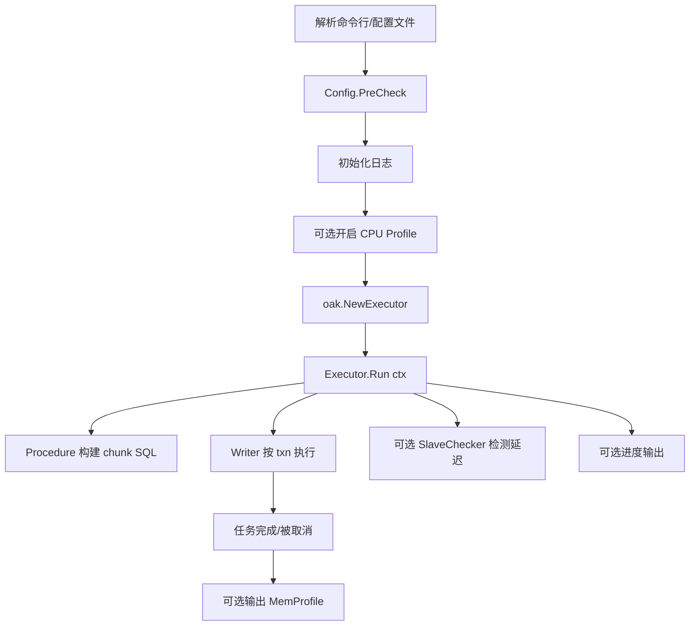

# go-oak-chunk CLI 使用手册（v3）

## 1. 文档目标

这份文档用于说明如何以 **CLI（命令行）方式** 使用 `go-oak-chunk` 执行大表 `UPDATE/DELETE` 的分块 DML。

覆盖内容：

- 安装与启动
- `run` 子命令参数详解
- 配置文件写法与参数映射
- 执行流程与限流/延迟控制机制
- 性能调优建议
- 常见报错与排障

---

## 2. 你会得到什么能力

`go-oak-chunk` 的 CLI 核心能力：

- 只支持 `UPDATE` / `DELETE`（单条 SQL），按 chunk 分批执行
- 利用主键/唯一键推进游标，避免全表扫描式批处理
- 支持从库延迟感知，动态调节节奏
- 支持运行中进度输出
- 支持 `SIGINT/SIGTERM` 优雅停止
- 支持 CPU / Memory profile 输出

---

## 3. 快速开始

### 3.1 构建二进制

```bash
make build
```

默认会生成 `goc`（来自 `Makefile` 中 `BINARY_NAME`）。

### 3.2 查看版本

```bash
./goc version
```

### 3.3 查看帮助

```bash
./goc --help
./goc run --help
```

如果你不想先构建，也可以直接：

```bash
go run ./cmd/go-oak-chunk run --help
```

---

## 4. 命令结构

- 根命令：`go-oak-chunk`（或构建后通常叫 `goc`）
- 子命令：
  - `run`：执行 chunk DML
  - `version`：打印版本信息（应用版本、Go 版本、构建时间、Git 信息）

---

## 5. `run` 参数详解（命令行模式）

> 说明：如果你传了 `--config`，大部分业务参数会从配置文件读取，本节参数仍然可作为参考。

| 参数 | 类型/默认值 | 必填 | 说明 | 关键注意点 |
|---|---|---|---|---|
| `-c, --config` | string / 空 | 否 | TOML 配置文件路径 | 开启配置文件模式 |
| `--cpuprofile` | string / 空 | 否 | 输出 CPU profile 文件 | 运行开始时启用 |
| `--memprofile` | string / 空 | 否 | 输出内存 profile 文件 | 任务结束后写出 |
| `--chunk-size` | int64 / `1000` | 否 | 每个 chunk 处理行数 | `0` 表示一次性；`1` 表示逐行 |
| `-e, --execute` | string / 空 | 是 | 要执行的 SQL | 必须是单条 `UPDATE/DELETE`，应包含 `WHERE` |
| `--force-chunking-column` | string / 空 | 否 | 强制指定 chunk 键列 | 必须与某个主键/唯一键列集合一致；OB 下会额外基于 `SHOW INDEX` 校验 |
| `-H, --host` | string / `localhost` | 否 | MySQL 主机 | |
| `-P, --port` | int / `3306` | 否 | MySQL 端口 | |
| `-u, --user` | string / `root` | 否 | MySQL 用户 | |
| `-p, --password` | string / 空 | 否 | MySQL 密码 | |
| `-d, --database` | string / 空 | **是（当前实现）** | 目标库名 | 虽帮助文案写“除非全限定表名”，但当前实现仍要求必填 |
| `--txn-size` | int64 / `1000` | 否 | 每个事务最多处理行数 | 控制单事务体量 |
| `--sleep` | int64 / `0` | 否 | chunk 间 sleep（毫秒） | 单位是 **毫秒** |
| `--noConsiderLag` | bool / `false` | 否 | 是否忽略 lag 放大逻辑 | `true` 时 sleep 不会被大幅拉高 |
| `--max-lag` | int64 / `0` | 否 | 延迟阈值（秒） | `>0` 时达到阈值会主动降速 |
| `--include-slaves` | string / 空 | 否 | 仅监控这些从库 IP（逗号分隔） | 与 `--exclude-slaves` 互斥 |
| `--exclude-slaves` | string / 空 | 否 | 排除这些从库 IP（逗号分隔） | 与 `--include-slaves` 互斥 |
| `--no-slaves` | bool / `false` | 否 | 跳过从库延迟检测 | TiDB/OceanBase 场景常用 |
| `--print-progress` | bool / `false` | 否 | 控制台打印进度 | 每 3 秒刷新 |
| `--debug` | bool / `false` | 否 | 打开 debug 日志 | |

---

## 6. 配置文件模式（推荐生产）

### 6.1 启动方式

```bash
./goc run -c /path/to/example.toml
```

### 6.2 参数来源优先级

当 `--config` 生效时：

- 业务参数来自 TOML（如 chunk、SQL、连接信息等）
- `--cpuprofile` / `--memprofile` 仍由命令行控制

可理解为“配置文件模式优先”。

### 6.3 TOML 字段映射

| TOML 字段 | 对应 CLI 参数 | 说明 |
|---|---|---|
| `chunk_size` | `--chunk-size` | chunk 大小 |
| `execute_query` | `--execute` | 执行 SQL |
| `forced_chunking_column` | `--force-chunking-column` | 强制 chunk 键（注意是 **forced**） |
| `host` | `--host` | 主库地址 |
| `port` | `--port` | 主库端口 |
| `database` | `--database` | 库名 |
| `user` | `--user` | 用户 |
| `password` | `--password` | 密码 |
| `print_progress` | `--print-progress` | 打印进度 |
| `sleep` | `--sleep` | 毫秒级 sleep |
| `no_consider_lag` | `--noConsiderLag` | lag 处理策略 |
| `max_lag` | `--max-lag` | 延迟阈值 |
| `include_slaves` | `--include-slaves` | 仅包含这些从库 |
| `exclude_slaves` | `--exclude-slaves` | 排除这些从库 |
| `no_slaves` | `--no-slaves` | 跳过从库检测 |
| `txn_size` | `--txn-size` | 事务大小 |
| `debug_mode` | `--debug` | debug 模式 |
| `correct` | 无直接 flag（内部修正值） | 建议维持 `50` |
| `no_log_bin` | 暂无 CLI 暴露 | 当前版本保留字段 |

### 6.4 推荐模板

```toml
debug_mode = true
chunk_size = 1000
execute_query = "DELETE FROM my_table WHERE created_at < '2025-01-01 00:00:00'"
forced_chunking_column = ""

host = "127.0.0.1"
port = 3306
database = "test_db"
user = "root"
password = "xxx"

print_progress = true
sleep = 0
no_consider_lag = false
max_lag = 0
include_slaves = ""
exclude_slaves = ""
no_slaves = false

txn_size = 2000
correct = 50
```

---

## 7. SQL 约束与执行前校验

CLI 启动后会做关键校验：

1. `chunk_size` 不能为负数
2. `execute_query` 不能为空
3. `include_slaves` 与 `exclude_slaves` 互斥
4. `database` 当前实现必须非空
5. SQL 必须是单条语句
6. SQL 类型必须是 `UPDATE` 或 `DELETE`
7. 目标表必须存在
8. 目标表必须存在可用主键/唯一键
9. 若设置 `forced_chunking_column`，必须精确匹配某个唯一键列集合；逗号两侧空格会自动忽略

---

## 8. 执行流程（CLI 到核心执行）



---

## 9. 限流与从库延迟控制机制

内部使用 1ms 粒度令牌桶，核心受以下参数影响：

- `sleep`（毫秒）
- `max_lag`（秒）
- `no_consider_lag`
- `correct`（修正值）

### 9.1 sleep 的真实行为

- `sleep=0`：不主动 sleep
- `0 < sleep <= 1000`：通常是 `[0, sleep)` 的随机等待
- `sleep > 1000`：通常是 `[sleep-1000, sleep)` 的随机等待

### 9.2 noConsiderLag

- `true`：sleep 不会被高 lag 进一步放大（更“硬”）
- `false`：会根据 lag 进行放大（更保守）

### 9.3 max-lag

当 `max_lag > 0` 且检测到 `lag >= max_lag` 时，执行会主动降速等待，给从库追平时间。

### 9.4 no-slaves

- `--no-slaves=true`：完全跳过从库延迟检测，只按 sleep/令牌桶节奏走
- 适合无标准主从拓扑场景（如 TiDB/OceanBase）

---

## 10. 停止语义与退出行为

CLI 对 `SIGINT/SIGTERM` 是优雅停止：

- 收到信号后取消运行上下文
- 内部统一映射为 `task.ErrExecutionStopped`
- `run` 子命令将其视为“正常停止”，返回成功（非错误退出）

这意味着你可以安全地用 `Ctrl+C` 中断任务，而不是硬杀进程。

---

## 11. Profile 使用

### 11.1 CPU Profile

```bash
./goc run ... --cpuprofile cpu.pprof
go tool pprof -http=:8080 cpu.pprof
```

### 11.2 Memory Profile

```bash
./goc run ... --memprofile mem.pprof
go tool pprof -http=:8081 mem.pprof
```

---

## 12. 常用命令示例

### 12.1 基础 UPDATE

```bash
./goc run \
  -d test \
  -e "UPDATE mybenchx1 SET k = 1 WHERE created_at <= '2024-12-28 11:30:06'" \
  --chunk-size 1000 \
  --txn-size 2000 \
  -H 127.0.0.1 -P 3306 -u root -p 'xxx' \
  --print-progress
```

### 12.2 带延迟保护的 DELETE

```bash
./goc run \
  -d test \
  -e "DELETE FROM mybenchx0 WHERE created_at <= '2024-12-21 00:03:13'" \
  --chunk-size 1000 \
  --txn-size 2000 \
  --sleep 300 \
  --max-lag 3 \
  --include-slaves "10.0.0.12,10.0.0.13" \
  -H 127.0.0.1 -P 3306 -u root -p 'xxx' \
  --print-progress --debug
```

### 12.3 使用配置文件

```bash
./goc run -c ./conf/example.toml --cpuprofile cpu.pprof --memprofile mem.pprof
```

### 12.4 TiDB/OceanBase 风格环境（跳过从库检测）

```bash
./goc run \
  -d test \
  -e "DELETE FROM t WHERE id > 1000000" \
  --no-slaves \
  --chunk-size 2000 \
  --txn-size 4000 \
  -H 127.0.0.1 -P 4000 -u root -p 'xxx'
```

> OceanBase 下会先通过兼容 DDL 获取列定义，再额外执行 `SHOW INDEX` 识别主键/唯一键。
> 因此即使兼容 DDL 中缺失全局唯一键，`--force-chunking-column order_code` 这类指定也仍可命中真实唯一索引。

---

## 13. 性能调优建议

### 13.1 参数联动原则

- 优先调 `chunk-size` 与 `txn-size`
- 再用 `sleep`、`max-lag` 控制对从库冲击
- 一般建议 `txn-size >= chunk-size`

### 13.2 建议起步值

| 场景 | chunk-size | txn-size | sleep | max-lag |
|---|---:|---:|---:|---:|
| 保守（线上高峰） | 500~1000 | 1000~2000 | 200~800 | 2~5 |
| 平衡（常规） | 1000~2000 | 2000~4000 | 0~300 | 0~3 |
| 激进（低峰+可回滚） | 2000~5000 | 4000~10000 | 0~100 | 0~1 |

---

## 14. 常见报错与排障

| 现象/错误 | 可能原因 | 处理建议 |
|---|---|---|
| `query to execute must be provided` | 未传 `--execute` 或配置缺失 | 补齐 SQL |
| `chunk size must be nonnegative` | `chunk-size < 0` | 改为 `>=0` |
| `--include-slaves and --exclude-slaves are mutually exclusive` | 两个参数同时设置 | 保留一个 |
| `no database specified` | 未设置 `--database`/`database` | 显式传库名 |
| `table xxx does not exist` | 库名或表名错误 | 检查 `database` 与 SQL |
| `please confirm sql type is update or delete` | SQL 不是 Update/Delete | 改为支持类型 |
| `can't find any index which is primary or unique key` | 目标表无主键/唯一键 | 增加唯一键或改表 |
| `forced_chunking_column doesn't conform ...` | 指定 chunk 列不匹配唯一键 | 改为真实唯一键列集合 |
| `show index ... failed` | OceanBase 索引元数据查询失败 | 检查权限、连接状态与表名；显式设置 `forced_chunking_column` 时会直接失败 |
| 运行中提示 `task stopped by signal` | 收到 SIGINT/SIGTERM | 正常停止语义 |
| 从库 lag 查询错误后继续运行 | 某些从库不可用或非标准拓扑 | 可用 `--no-slaves` 或过滤从库 |

---

## 15. 生产使用建议（强烈建议）

- 在影子库或小范围先做参数压测
- SQL 必须带明确 `WHERE`，避免误操作
- 使用最小权限账号，避免高危权限扩散
- 先备份或确保可回滚路径
- 高峰期使用保守参数，低峰期逐步放大
- 保留 profile 和执行日志，便于复盘

---

## 16. 与当前实现相关的注意事项（避免踩坑）

1. 帮助文案写 `database` 在全限定表名时可省略，但当前实现仍要求提供 `database`
2. `sleep` 单位是 **毫秒**，不是秒
3. 配置文件键是 `forced_chunking_column`，不是 `force_chunking_column`
4. CLI 无配置文件时会自动把 `correct` 设为 `50`；配置文件模式建议显式给 `correct = 50`
5. `run` 正常被信号停止时按成功处理，不属于错误退出

以上 5 点建议在团队内作为统一使用约定。
