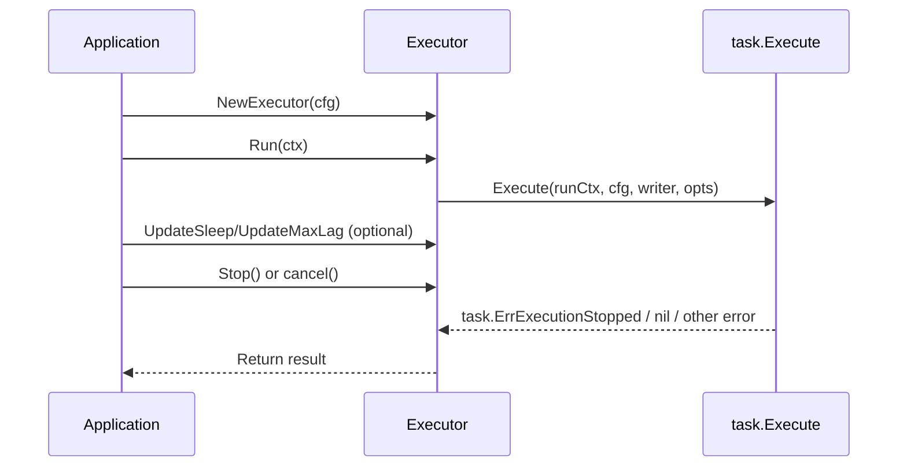

# go-oak-chunk SDK User Guide (v3)

[English](sdk-usage-en.md) | [简体中文](sdk-usage.md)

## 1. Document scope

This document explains how to embed `go-oak-chunk` into a service as a **Go SDK**, rather than running it only from the command line.

It covers:

- Module import and a minimal runnable example
- The `Executor` API and lifecycle
- The complete `conf.Config` model
- Logger integration and callbacks
- Runtime tuning of `sleep`/`maxLag`
- Error semantics, stop semantics, and concurrency constraints
- Production integration recommendations

---

## 2. Suitable scenarios

The SDK mode is suitable when:

- You already have a long-running service and need embedded chunked DML execution
- You want to integrate with existing logging, monitoring, configuration centers, and signal handling
- You want to adjust execution pace at runtime, for example by changing sleep based on system load
- You need to manage task lifecycle in code, including start, stop, timeout, and cancellation
- You need data-source-specific DELETE acceleration: OceanBase covering-index fast path / partition concurrency (`WithOBCovering` / `WithPartitionConcurrency`), or TiDB cleanup of tables without a primary key through `_tidb_rowid` (`WithTiDBRowID`)

---

## 3. Dependency and import

### 3.1 Go Module

```bash
go get github.com/SisyphusSQ/go-oak-chunk/v3
```

### 3.2 Recommended imports

```go
import (
    "context"
    "errors"
    "time"

    oak "github.com/SisyphusSQ/go-oak-chunk/v3"
    "github.com/SisyphusSQ/go-oak-chunk/v3/conf"
    oaklog "github.com/SisyphusSQ/go-oak-chunk/v3/log"
    "github.com/SisyphusSQ/go-oak-chunk/v3/task"
)
```

---

## 4. Core API overview

| API | Purpose | Key semantics |
|---|---|---|
| `oak.NewExecutor(config, opts...)` | Create an executor | Validates configuration and initializes the underlying writer |
| `(*Executor).Run(ctx)` | Start a task | **one-shot**: the same instance can call `Run` only once |
| `(*Executor).Stop()` | Stop actively | Idempotent and safe to call repeatedly |
| `(*Executor).UpdateSleep(ms)` | Change sleep dynamically | Negative values are clamped to `0` |
| `(*Executor).UpdateMaxLag(lag)` | Change the lag threshold dynamically | Negative values are clamped to `0` |
| `(*Executor).GetStatus()` | Read a status snapshot | Returns affected rows, elapsed time, sleep, lag, and other state |
| `oak.WithProgressCallback(cb, interval)` | Inject a progress callback | Slow callbacks skip ticks to avoid backlog |
| `oak.WithRateLimiter(rl)` | Inject a custom rate limiter | Can take over sleep/maxLag/noConsiderLag completely |
| `oak.WithRowsPerSec(n)` | Set a global rows-per-second cap | `0` = unlimited; combines with the sleep/maxLag token bucket |
| `oak.WithMaxRows(n)` | Stop after processing `n` rows | `0` = unlimited; applies to all three strategies |
| `oak.WithMaxDuration(ms)` | Stop after running for `ms` milliseconds | `0` = unlimited; applies to all three strategies |
| `oak.WithPartitionConcurrency(n)` | OceanBase partition-concurrent DELETE | `0/1` = disabled; requires the covering fast path and a partitioned table |
| `oak.WithTiDBRowID(true)` | TiDB chunk DELETE by `_tidb_rowid` | DELETE only; NONCLUSTERED table without PK/UK; mutually exclusive with covering fast path/partition concurrency |

Common errors:

- `oak.ErrExecutorAlreadyRun`: `Run` was called more than once
- `task.ErrExecutionStopped`: unified stop error after cancellation/stop; normally treated as an expected stop

---

## 5. Minimal runnable example

```go
package main

import (
    "context"
    "errors"
    "fmt"
    "time"

    oak "github.com/SisyphusSQ/go-oak-chunk/v3"
    "github.com/SisyphusSQ/go-oak-chunk/v3/conf"
    "github.com/SisyphusSQ/go-oak-chunk/v3/task"
)

func main() {
    cfg := &conf.Config{
        Host:         "127.0.0.1",
        Port:         3306,
        User:         "root",
        Password:     "xxx",
        Database:     "test_db",
        ExecuteQuery: "DELETE FROM orders WHERE created_at < '2025-01-01 00:00:00'",
        ChunkSize:    1000,
        TxnSize:      2000,
        Sleep:        200, // milliseconds
        MaxLag:       3,   // seconds
        Correct:      50,  // recommended value
    }

    executor, err := oak.NewExecutor(cfg)
    if err != nil {
        panic(err)
    }

    ctx, cancel := context.WithTimeout(context.Background(), 10*time.Minute)
    defer cancel()

    err = executor.Run(ctx)
    if err != nil {
        if errors.Is(err, task.ErrExecutionStopped) {
            fmt.Println("Task canceled/stopped; treat it as a normal stop")
            return
        }
        panic(err)
    }
}
```

---

## 6. Complete `conf.Config` reference

> The SDK recommends constructing `conf.Config` explicitly instead of relying on implicit defaults.

### 6.1 Key fields

> The SDK constructs `conf.Config` directly. Fields that are not assigned explicitly use Go **zero values** (numbers = `0`, bools = `false`, strings = empty). The “Default/recommendation” column below follows that behavior.

| Field | Type | Default/recommendation | Description |
|---|---|---|---|
| `ExecuteQuery` | `string` | Required | Single-statement `UPDATE/DELETE` SQL |
| `Database` | `string` | Required unless SQL uses `schema.table` | Must match the SQL schema when both are provided |
| `Host` | `string` | Required | Primary address |
| `Port` | `int` | Required | Primary port |
| `User` | `string` | Required | Username |
| `Password` | `string` | Recommended required | Password |
| `ChunkSize` | `int64` | Start at `1000` | Rows per chunk; `0` means one operation |
| `TxnSize` | `int64` | `>= ChunkSize` | Maximum rows per transaction |
| `Sleep` | `int64` | `0` (`0`–`800`) | Pace control in milliseconds |
| `MaxLag` | `int64` | `0` (`0`–`5`) | Replica-lag threshold in seconds; `0`=unlimited |
| `NoConsiderLag` | `bool` | `false` | When `true`, do not expand sleep according to lag |
| `IncludeSlaves` | `string` | Empty | Monitor only these replicas |
| `ExcludeSlaves` | `string` | Empty | Exclude these replicas |
| `NoSlaves` | `bool` | `false` | Skip replica checks |
| `ForceChunkingColumn` | `string` | Empty | Force a unique-key column set; OB also validates with `SHOW INDEX`, and spaces around commas are ignored |
| `PrintProgress` | `bool` | `false` | Enables CLI terminal output mode |
| `Debug` | `bool` | `false` | Debug logging |
| `Correct` | `int64` | **Recommended: 50** | Rate-limit correction value (CLI default `50`; SDK zero value is `0`, so set it explicitly to `50`) |
| `RowsPerSec` | `int64` | `0` | Global rows-per-second cap; `0`=unlimited; combines with sleep/maxLag |
| `SelectOrderBy` | `string` | Empty | Covering-index fast-path ordering columns (comma-separated, DELETE only); prerequisite for `PartitionConcurrency` |
| `SelectIndex` | `string` | Empty | `FORCE INDEX` name for the candidate SELECT; requires `SelectOrderBy` |
| `SelectCursor` | `bool` | `false` | Advance candidate SELECT with a cursor instead of rescanning; requires `SelectOrderBy`, recommended for large tables |
| `MaxRows` | `int64` | `0` | Stop after the row limit; `0`=unlimited; applies to all three strategies |
| `MaxDuration` | `int64` | `0` | Stop after the time limit in milliseconds; `0`=unlimited; applies to all three strategies |
| `PartitionConcurrency` | `int` | `0` | OceanBase partition-concurrent DELETE worker count; `0/1`=disabled |
| `TiDBRowID` | `bool` | `false` | TiDB chunk DELETE by `_tidb_rowid` (NONCLUSTERED table, no PK/UK); mutually exclusive with covering fast path/partition/`ForceChunkingColumn` |
| `DryRun` | `bool` | `false` | Print sample SQL without executing |
| `PreflightThreshold` | `int64` | `0` | EXPLAIN threshold for large-table confirmation; `0`=default `100000` |
| `AutoConfirm` | `bool` | `false` | Skip large-table confirmation; recommended for SDK/non-interactive use |

### 6.2 What does `PreCheck` validate?

`NewExecutor` calls `config.PreCheck()` internally. It mainly validates:

- `ChunkSize >= 0`
- `ExecuteQuery` is not empty
- `IncludeSlaves` and `ExcludeSlaves` are mutually exclusive

> Note: the non-empty `Database` check happens during writer initialization, not inside `PreCheck`.

### 6.3 A subtle CLI difference

The CLI’s “pure command-line mode” automatically sets `Correct` to `50`.
SDK mode does not inject this value automatically, so set it explicitly in code:

```go
cfg.Correct = 50
```

---

## 7. Lifecycle and concurrency semantics (important)

### 7.1 `Executor` is one-shot

The same `Executor` instance can run only once:

- First `Run(ctx)`: executes normally
- Second `Run(ctx)`: immediately returns `oak.ErrExecutorAlreadyRun`

The second call returns this error even if the first run stopped because it was canceled.

### 7.2 `Stop()` semantics

- `Stop()` calls cancel internally
- It is safe to call repeatedly (idempotent)
- It is safe to call when no task is running

### 7.3 Recommended lifecycle pattern



---

## 8. Error-handling recommendations

Use `errors.Is` consistently for classification:

```go
err := executor.Run(ctx)
switch {
case err == nil:
    // success
case errors.Is(err, task.ErrExecutionStopped):
    // User cancellation, signal stop, timeout, and other unified stop semantics
case errors.Is(err, oak.ErrExecutorAlreadyRun):
    // The instance was reused
default:
    // Actual failure: connection, SQL parsing, execution, and so on
}
```

Common failure sources:

- SQL is not a single statement or is not `UPDATE|DELETE`
- Target table does not exist
- No primary or unique key can be found
- `ForceChunkingColumn` does not match
- `SHOW INDEX` fails on OceanBase (explicit `ForceChunkingColumn` causes a direct failure)
- Database connection or execution failure

---

## 9. Progress callback: `WithProgressCallback`

### 9.1 Usage

```go
executor, err := oak.NewExecutor(
    cfg,
    oak.WithProgressCallback(func(s *oak.ExecutorStatus) {
        if s == nil {
            return
        }
        // Report metrics or write logs
        // s.RowAffects / s.ElapsedTime / s.CurrentSleep / s.MaxSlaveLag / s.IsFinished
    }, 2*time.Second),
)
```

### 9.2 Callback behavior

- The callback fires at the configured `interval`
- Callback execution is asynchronous
- If the previous callback has not finished, the current tick is skipped to prevent queue buildup
- Callback panics are recovered and do not bring down the main flow
- When the task ends, the SDK attempts to push one final snapshot; it may be skipped if the previous callback is still running

### 9.3 Practical recommendations

- Do not perform heavy blocking I/O inside the callback
- If the callback needs to report over the network, enqueue that work asynchronously
- Add a timeout around callback work so transport jitter does not affect collection

---

## 10. Runtime tuning

### 10.1 Change sleep / maxLag dynamically

```go
executor.UpdateSleep(500) // 500ms
executor.UpdateMaxLag(5)  // 5s
```

Negative values are clamped to `0`.

### 10.2 Read the status snapshot

```go
st := executor.GetStatus()
fmt.Printf(
    "rows=%d elapsed=%s sleep=%d lag=%d finished=%v\n",
    st.RowAffects, st.ElapsedTime, st.CurrentSleep, st.MaxSlaveLag, st.IsFinished,
)
```

### 10.3 Simplified dynamic-control example

```go
ticker := time.NewTicker(5 * time.Second)
defer ticker.Stop()

for {
    select {
    case <-ctx.Done():
        return
    case <-ticker.C:
        st := executor.GetStatus()
        // Example policy: slow down when lag is serious
        if st.MaxSlaveLag > 5 {
            executor.UpdateSleep(800)
        } else {
            executor.UpdateSleep(200)
        }
    }
}
```

---

## 11. Custom rate limiter: `WithRateLimiter`

If you want to manage the rate limiter yourself:

```go
rl := task.NewRateLimiter(
    300,  // sleep(ms)
    3,    // maxLag(s)
    50,   // correct
    false, // noConsiderLag
)

executor, err := oak.NewExecutor(cfg, oak.WithRateLimiter(rl))
```

Use cases:

- A unified rate-limiting policy across multiple tasks
- Integration with your own parameter controller
- Different pace templates for different business types

---

## 11bis. Row-rate caps and guardrails

> **Rate-limiting model (two independent mechanisms)**: both take effect after every chunk is committed, and the stricter one determines the final pace.
> - **Mechanism A (token bucket)**: controls “time pacing + replica protection”, using `Sleep`/`MaxLag`/`NoConsiderLag`/`Correct`. One token = 1 ms; the `getStopTime` goroutine checks replica lag and calculates the milliseconds to wait. When `lag>=MaxLag`, consumers pause for about one second while replicas catch up.
> - **Mechanism B (rows-per-sec)**: controls “row throughput” with an independent limiter; each batch waits `affected/RowsPerSec` seconds.
> - Both are **globally shared** under partition concurrency, limiting aggregate table throughput.
> - For the full derivation, see the CLI guide (section 9): [cli-usage-en.md](cli-usage-en.md).

### 11bis.1 `WithRowsPerSec` (global row-rate cap)

```go
oak.NewExecutor(cfg, oak.WithRowsPerSec(50000)) // or set cfg.RowsPerSec = 50000
```

- Adds a **global per-row rate cap** in addition to the token bucket (`Sleep`) and replica lag (`MaxLag`)
- Requests quota based on the current batch size before each DML and waits if the quota is insufficient; all three limiters combine, and the strictest determines the final pace
- `0` means unlimited
- The limiter is globally shared: all workers in partition-concurrent mode use the same limiter, which limits the **aggregate table rate**

> Full speed: when `Sleep=0` and `RowsPerSec=0` (and `MaxLag` is not triggered), there is no implicit waiting. v3.2.0 fixed a bug that made covering-index/partition DELETE wait by row count after every chunk (about 1 ms per row); before the fix, even disabled rate limiting could be reduced to about 1,000 rows/s.

### 11bis.2 `WithMaxRows` / `WithMaxDuration` (stop when enough)

```go
oak.NewExecutor(cfg,
    oak.WithMaxRows(2000000),      // stop after 2 million total rows
    oak.WithMaxDuration(600000),   // or after 10 minutes
)
```

- Reaching either limit stops the task; `0` means unlimited
- Earlier versions allowed these options only on the covering fast path; **that restriction has been removed**: range, covering, and partition strategies all enforce them
- Stopping is **coarse-grained**: range stops at a transaction/chunk boundary, covering at a chunk boundary, and partition trims the batch to the remaining allowance. `MaxRows` is exact across workers and never over-deletes.

---

## 11ter. OceanBase partition-concurrent DELETE (`WithPartitionConcurrency`)

```go
oak.NewExecutor(cfg,
    oak.WithOBCovering("", "id", false), // covering fast path; provides SelectOrderBy
    oak.WithPartitionConcurrency(4),     // four parallel workers
    oak.WithRowsPerSec(50000),
    oak.WithMaxRows(2000000),
)
```

Activation conditions, validated by `NewExecutor` prechecks and runtime partition discovery:

- Data source is **OceanBase**
- The covering fast path is enabled by setting `SelectOrderBy` (DELETE only)
- The target table is partitioned (detected through `information_schema.PARTITIONS`)
- `n >= 2` enables it; `0/1` falls back to a single-worker covering/range path

Concurrency behavior:

- Worker count is clamped to `min(configured value, actual partition count, internal hard limit 64)`
- Each worker claims one partition and owns its cursor; DELETE is scoped to that partition
- The connection-pool limit grows automatically with concurrency (approximately `concurrency + 2`)
- Rate limiters (token bucket + `RowsPerSec`) are **globally shared**, limiting aggregate table throughput
- Replica-lag pauses (`MaxLag`) are **global**, so all workers pause together
- `MaxRows` is **exact** across workers (aggregate never exceeds the limit; zero over-delete); `MaxRows=0` remains unlimited
- An error in any worker cancels the entire concurrent group and returns the first error

---

## 11quater. TiDB `_tidb_rowid` cleanup (`WithTiDBRowID`)

```go
oak.NewExecutor(cfg,
    oak.WithTiDBRowID(true), // or set cfg.TiDBRowID = true
)
```

- Uses TiDB’s hidden row handle `_tidb_rowid` as the chunking key, allowing TiDB **NONCLUSTERED** tables without a primary or unique key to run batched DELETE
- **DELETE only**; explicit opt-in, so TiDB’s default behavior remains unchanged (range chunking by default)
- Mutually exclusive with `SelectOrderBy`/`SelectCursor`/`SelectIndex`/`PartitionConcurrency>1`/`ForceChunkingColumn`; `PreCheck` validates these constraints; requires `ChunkSize > 0`
- Runtime applicability is checked through `information_schema.tables.TIDB_PK_TYPE`; CLUSTERED tables produce a clear error (older versions fall back to probing `_tidb_rowid`)
- Uses a seek cursor (`_tidb_rowid > cursor`) plus `_tidb_rowid IN (...)` DELETE; it handles sparse rowids caused by `SHARD_ROW_ID_BITS`/`AUTO_RANDOM`. The cursor advances only after DELETE commits, and the frozen `WHERE` is always reused
- Reuses the existing `MaxRows`/`MaxDuration` guardrails, `RowsPerSec`/sleep/lag limiters, and failure retries, including TiDB write-conflict codes

---

## 12. Logger integration

The SDK offers three common approaches:

### 12.1 A: do not initialize anything

`NewExecutor` automatically initializes the default logger, writing to stderr.

### 12.2 B: use the SDK’s built-in initialization

```go
_ = oaklog.New(true, oaklog.OutputStderr) // debug + stderr
```

### 12.3 C: reuse an existing zap logger (recommended)

```go
// sugar := yourZapLogger.Sugar()
oaklog.NewFromSugaredLogger(sugar)
```

This is suitable for sending SDK logs into your existing logging platform and trace pipeline.

---

## 13. Recommended production integration pattern

1. Load configuration when the service starts (database, pace parameters, and SQL template)
2. Call `oak.NewExecutor` to create the task object
3. Wrap `Run` with `context.WithTimeout`
4. Report progress metrics through the callback (QPS, row_affected, lag)
5. Expose an operations endpoint to adjust `sleep/maxLag` dynamically
6. Call `Stop()` on process shutdown, then wait for `Run` to exit

---

## 14. Common questions and troubleshooting

| Problem | Cause | Solution |
|---|---|---|
| `executor can only run once` | `Run` called more than once on the same instance | Create a new `Executor` for each task |
| `task.ErrExecutionStopped` returned | Active `Stop`/`cancel`/timeout | Treat it as a normal stop |
| `no database specified` | `Database` is empty | Set `cfg.Database` explicitly |
| `please confirm sql type is update or delete` | Unsupported SQL type | Use a single UPDATE/DELETE statement |
| `can't find any index which is primary or unique key` | Table has no unique key | Add a primary/unique key |
| `forced_chunking_column doesn't conform ...` | Specified columns do not match a unique key | Use the actual unique-key column set |
| `show index ... failed` | OceanBase index metadata query failed | Check permissions, connection state, and table name; explicit `ForceChunkingColumn` causes a direct failure |
| Callback frequency is unstable | Callback is too slow and ticks are skipped | Shorten the callback and move expensive work asynchronously |

---

## 15. CLI mapping (migration reference)

| CLI option | SDK configuration/API |
|---|---|
| `--execute` | `conf.Config.ExecuteQuery` |
| `--database` | `conf.Config.Database` |
| `--chunk-size` | `conf.Config.ChunkSize` |
| `--txn-size` | `conf.Config.TxnSize` |
| `--sleep` | `conf.Config.Sleep` or `executor.UpdateSleep()` |
| `--max-lag` | `conf.Config.MaxLag` or `executor.UpdateMaxLag()` |
| `--noConsiderLag` | `conf.Config.NoConsiderLag` |
| `--include-slaves` | `conf.Config.IncludeSlaves` |
| `--exclude-slaves` | `conf.Config.ExcludeSlaves` |
| `--no-slaves` | `conf.Config.NoSlaves` |
| `--debug` | `conf.Config.Debug` |
| `--rows-per-sec` | `conf.Config.RowsPerSec` or `oak.WithRowsPerSec()` |
| `--select-order-by` | `conf.Config.SelectOrderBy` or `oak.WithOBCovering()` |
| `--max-rows` | `conf.Config.MaxRows` or `oak.WithMaxRows()` |
| `--max-duration-ms` | `conf.Config.MaxDuration` or `oak.WithMaxDuration()` |
| `--partition-concurrency` | `conf.Config.PartitionConcurrency` or `oak.WithPartitionConcurrency()` |
| `--print-progress` | CLI-only terminal output; use `WithProgressCallback` in the SDK |

---

## 16. Best-practice checklist

- Use a new `Executor` for every execution; do not reuse it
- SQL must have a clear `WHERE`, and should be validated with a small workload first
- Set `Correct=50` explicitly to match CLI behavior
- Give `Run` a timeout context to avoid hanging
- Treat `task.ErrExecutionStopped` as an expected stop
- Keep callbacks fast and process slow work asynchronously
- Use `UpdateSleep/UpdateMaxLag` for online pace control

---

## 17. More complete service example (stop and dynamic pacing)

```go
func RunChunkJob(ctx context.Context, cfg *conf.Config) error {
    cfg.Correct = 50

    executor, err := oak.NewExecutor(
        cfg,
        oak.WithProgressCallback(func(s *oak.ExecutorStatus) {
            // metrics.Observe(...)
            _ = s
        }, 3*time.Second),
    )
    if err != nil {
        return err
    }

    // Dynamic pace-control goroutine
    ctrlCtx, ctrlCancel := context.WithCancel(ctx)
    defer ctrlCancel()
    go func() {
        ticker := time.NewTicker(5 * time.Second)
        defer ticker.Stop()
        for {
            select {
            case <-ctrlCtx.Done():
                return
            case <-ticker.C:
                st := executor.GetStatus()
                if st.MaxSlaveLag > 8 {
                    executor.UpdateSleep(1000)
                } else if st.MaxSlaveLag > 3 {
                    executor.UpdateSleep(500)
                } else {
                    executor.UpdateSleep(150)
                }
            }
        }
    }()

    runErr := executor.Run(ctx)
    if runErr != nil && errors.Is(runErr, task.ErrExecutionStopped) {
        return nil
    }
    return runErr
}
```

This pattern covers the core production needs for observability, online pace control, and interruption.
