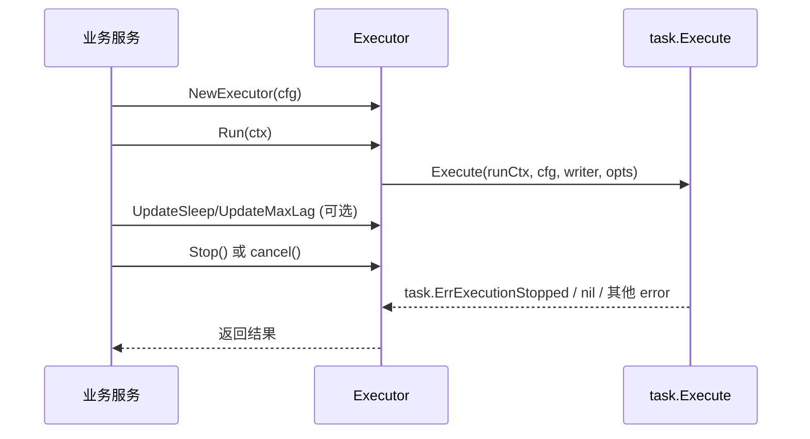

# go-oak-chunk SDK 使用手册（v3）

## 1. 文档目标

这份文档说明如何把 `go-oak-chunk` 作为 **Go SDK** 嵌入你的服务，而不是只通过命令行运行。

覆盖内容：

- 模块引入与最小可运行示例
- `Executor` API 与生命周期
- 配置模型（`conf.Config`）完整说明
- 日志接入与回调机制
- 运行时动态调参（sleep/maxLag）
- 错误语义、停止语义与并发约束
- 生产集成建议

---

## 2. 适用场景

SDK 方式适合：

- 你已经有常驻服务，需要“嵌入式”执行 chunk DML
- 你要统一接入已有日志、监控、配置中心、信号处理
- 你希望运行中动态调整节奏（例如根据系统负载自动调 sleep）
- 你需要用代码方式管理任务生命周期（启动/停止/超时/取消）

---

## 3. 依赖与导入

### 3.1 Go Module

```bash
go get github.com/SisyphusSQ/go-oak-chunk/v3
```

### 3.2 导入建议

```go
import (
    "context"
    "errors"
    "time"

    oak "github.com/SisyphusSQ/go-oak-chunk/v3"
    "github.com/SisyphusSQ/go-oak-chunk/v3/conf"
    oaklog "github.com/SisyphusSQ/go-oak-chunk/v3/log"
    "github.com/SisyphusSQ/go-oak-chunk/v3/task"
)
```

---

## 4. 核心 API 总览

| API | 作用 | 关键语义 |
|---|---|---|
| `oak.NewExecutor(config, opts...)` | 创建执行器 | 会校验配置并初始化底层 writer |
| `(*Executor).Run(ctx)` | 启动任务 | **one-shot**：同一个实例只能 `Run` 一次 |
| `(*Executor).Stop()` | 主动停止 | 幂等，可重复调用 |
| `(*Executor).UpdateSleep(ms)` | 动态修改 sleep | 负值会被钳制为 `0` |
| `(*Executor).UpdateMaxLag(lag)` | 动态修改 lag 阈值 | 负值会被钳制为 `0` |
| `(*Executor).GetStatus()` | 读取快照状态 | 返回当前已影响行数、耗时、sleep、lag 等 |
| `oak.WithProgressCallback(cb, interval)` | 注入进度回调 | 回调慢时会跳 tick，避免积压 |
| `oak.WithRateLimiter(rl)` | 注入自定义限流器 | 可完全接管 sleep/maxLag/noConsiderLag |

常见错误：

- `oak.ErrExecutorAlreadyRun`：重复调用 `Run`
- `task.ErrExecutionStopped`：被取消/停止后的统一停止错误（业务上通常视为正常停止）

---

## 5. 最小可运行示例

```go
package main

import (
    "context"
    "errors"
    "fmt"
    "time"

    oak "github.com/SisyphusSQ/go-oak-chunk/v3"
    "github.com/SisyphusSQ/go-oak-chunk/v3/conf"
    "github.com/SisyphusSQ/go-oak-chunk/v3/task"
)

func main() {
    cfg := &conf.Config{
        Host:         "127.0.0.1",
        Port:         3306,
        User:         "root",
        Password:     "xxx",
        Database:     "test_db",
        ExecuteQuery: "DELETE FROM orders WHERE created_at < '2025-01-01 00:00:00'",
        ChunkSize:    1000,
        TxnSize:      2000,
        Sleep:        200, // 毫秒
        MaxLag:       3,   // 秒
        Correct:      50,  // 建议保持 50
    }

    executor, err := oak.NewExecutor(cfg)
    if err != nil {
        panic(err)
    }

    ctx, cancel := context.WithTimeout(context.Background(), 10*time.Minute)
    defer cancel()

    err = executor.Run(ctx)
    if err != nil {
        if errors.Is(err, task.ErrExecutionStopped) {
            fmt.Println("任务被取消/停止，按正常停止处理")
            return
        }
        panic(err)
    }
}
```

---

## 6. `conf.Config` 完整说明

> SDK 侧推荐显式构造 `conf.Config`，不要依赖隐式默认值。

### 6.1 关键字段一览

| 字段 | 类型 | 建议 | 说明 |
|---|---|---|---|
| `ExecuteQuery` | `string` | 必填 | 单条 `UPDATE/DELETE` SQL |
| `Database` | `string` | 必填 | 当前实现要求非空 |
| `Host` | `string` | 必填 | 主库地址 |
| `Port` | `int` | 必填 | 主库端口 |
| `User` | `string` | 必填 | 用户名 |
| `Password` | `string` | 建议必填 | 密码 |
| `ChunkSize` | `int64` | `1000` 起步 | 每 chunk 行数；`0` 表示一次性 |
| `TxnSize` | `int64` | `>= ChunkSize` | 每事务最大处理行数 |
| `Sleep` | `int64` | 0~800 | 毫秒级节奏控制 |
| `MaxLag` | `int64` | 0~5 | 从库延迟阈值（秒） |
| `NoConsiderLag` | `bool` | 按需 | `true` 时不按 lag 放大 sleep |
| `IncludeSlaves` | `string` | 按需 | 仅监控这些从库 |
| `ExcludeSlaves` | `string` | 按需 | 排除这些从库 |
| `NoSlaves` | `bool` | 按需 | 跳过从库检查 |
| `ForceChunkingColumn` | `string` | 按需 | 强制使用指定唯一键列集；OB 下会额外基于 `SHOW INDEX` 校验，逗号两侧空格会自动忽略 |
| `PrintProgress` | `bool` | SDK 通常 `false` | CLI 终端输出模式开关 |
| `Debug` | `bool` | 按需 | debug 日志 |
| `Correct` | `int64` | **建议 50** | 限流修正值 |

### 6.2 `PreCheck` 会校验什么

`NewExecutor` 内部会调用 `config.PreCheck()`，主要校验：

- `ChunkSize >= 0`
- `ExecuteQuery` 非空
- `IncludeSlaves` 与 `ExcludeSlaves` 互斥

> 注意：`Database` 非空检查在 writer 初始化阶段做，不在 `PreCheck` 里。

### 6.3 与 CLI 的一个细微差异

CLI 的“纯命令行模式”会自动把 `Correct` 设为 `50`；  
SDK 模式不会自动注入这个值，建议你在代码里显式设置：

```go
cfg.Correct = 50
```

---

## 7. 生命周期与并发语义（非常重要）

### 7.1 `Executor` 是 one-shot

同一个 `Executor` 实例只能运行一次：

- 第一次 `Run(ctx)`：正常执行
- 第二次 `Run(ctx)`：直接返回 `oak.ErrExecutorAlreadyRun`

即使第一次是因为取消停止，第二次依然会返回这个错误。

### 7.2 `Stop()` 语义

- `Stop()` 内部调用 cancel
- 可重复调用（幂等）
- 没有运行中的任务时调用也安全

### 7.3 推荐生命周期模式



---

## 8. 错误处理建议

推荐统一使用 `errors.Is` 做分类：

```go
err := executor.Run(ctx)
switch {
case err == nil:
    // success
case errors.Is(err, task.ErrExecutionStopped):
    // 用户取消、信号停止、超时等统一停止语义
case errors.Is(err, oak.ErrExecutorAlreadyRun):
    // 复用实例导致
default:
    // 真正失败：建连、SQL 解析、执行等
}
```

常见失败来源：

- SQL 非单条 / 非 `UPDATE|DELETE`
- 目标表不存在
- 找不到主键或唯一键
- `ForceChunkingColumn` 不匹配
- OceanBase 下 `SHOW INDEX` 查询失败（显式设置 `ForceChunkingColumn` 时会直接报错）
- 数据库连接失败或执行失败

---

## 9. 进度回调：`WithProgressCallback`

### 9.1 使用方式

```go
executor, err := oak.NewExecutor(
    cfg,
    oak.WithProgressCallback(func(s *oak.ExecutorStatus) {
        if s == nil {
            return
        }
        // 上报 metrics 或写日志
        // s.RowAffects / s.ElapsedTime / s.CurrentSleep / s.MaxSlaveLag / s.IsFinished
    }, 2*time.Second),
)
```

### 9.2 回调行为细节

- 回调按 `interval` 周期触发
- 回调执行是异步的
- 如果上一次回调还没结束，当前 tick 会跳过（防止队列堆积）
- 回调 panic 会被 recover，不会拖垮主流程
- 任务结束时会尝试推送一次最终快照（若上一次回调仍未结束，可能被跳过）

### 9.3 实践建议

- 回调内不要做重 I/O 阻塞操作
- 回调中如需网络上报，建议再异步投递
- 给回调加超时保护，避免链路抖动反向影响采集

---

## 10. 运行时动态调参

### 10.1 动态修改 sleep / maxLag

```go
executor.UpdateSleep(500) // 500ms
executor.UpdateMaxLag(5)  // 5s
```

负值会自动钳制到 `0`。

### 10.2 查询状态快照

```go
st := executor.GetStatus()
fmt.Printf(
    "rows=%d elapsed=%s sleep=%d lag=%d finished=%v\n",
    st.RowAffects, st.ElapsedTime, st.CurrentSleep, st.MaxSlaveLag, st.IsFinished,
)
```

### 10.3 动态控制样例（简化版）

```go
ticker := time.NewTicker(5 * time.Second)
defer ticker.Stop()

for {
    select {
    case <-ctx.Done():
        return
    case <-ticker.C:
        st := executor.GetStatus()
        // 示例策略：落后严重就放慢
        if st.MaxSlaveLag > 5 {
            executor.UpdateSleep(800)
        } else {
            executor.UpdateSleep(200)
        }
    }
}
```

---

## 11. 自定义限流器：`WithRateLimiter`

如果你希望自行管理限流器：

```go
rl := task.NewRateLimiter(
    300,  // sleep(ms)
    3,    // maxLag(s)
    50,   // correct
    false, // noConsiderLag
)

executor, err := oak.NewExecutor(cfg, oak.WithRateLimiter(rl))
```

用途：

- 多任务统一限流策略
- 接入你自己的参数控制器
- 对不同业务类型使用不同节奏模板

---

## 12. 日志接入策略

SDK 常见三种方式：

### 12.1 方式 A：你不做任何初始化

`NewExecutor` 会自动初始化默认 logger（输出到 stderr）。

### 12.2 方式 B：使用 SDK 内置初始化

```go
_ = oaklog.New(true, oaklog.OutputStderr) // debug + stderr
```

### 12.3 方式 C：复用你已有的 zap logger（推荐）

```go
// sugar := yourZapLogger.Sugar()
oaklog.NewFromSugaredLogger(sugar)
```

适合把 SDK 日志并入你现有日志平台与 trace pipeline。

---

## 13. 生产集成范式（推荐）

1. 服务启动时装载配置（DB、节奏参数、SQL 模板）
2. 调用 `oak.NewExecutor` 创建任务对象
3. 用 `context.WithTimeout` 包裹 `Run`
4. 用回调上报进度指标（QPS、row_affected、lag）
5. 暴露运维接口动态调 `sleep/maxLag`
6. 进程退出时先 `Stop()`，再等待 `Run` 退出

---

## 14. 常见问题与排障

| 问题 | 原因 | 解决 |
|---|---|---|
| `executor can only run once` | 同实例重复 `Run` | 每次任务创建新 `Executor` |
| 返回 `task.ErrExecutionStopped` | 主动 `Stop`/`cancel`/超时 | 作为正常停止处理 |
| `no database specified` | `Database` 空 | 显式设置 `cfg.Database` |
| `please confirm sql type is update or delete` | SQL 类型不支持 | 仅使用单条 Update/Delete |
| `can't find any index which is primary or unique key` | 表无唯一键 | 增加主键/唯一键 |
| `forced_chunking_column doesn't conform ...` | 指定列不匹配唯一键 | 使用真实唯一键列集合 |
| `show index ... failed` | OceanBase 索引元数据查询失败 | 检查权限、连接状态与表名；若设置了 `ForceChunkingColumn` 会直接失败 |
| 回调触发频率不稳定 | 回调执行太慢，tick 被跳过 | 缩短回调逻辑，异步化重操作 |

---

## 15. 与 CLI 的映射（迁移参考）

| CLI 参数 | SDK 配置/API |
|---|---|
| `--execute` | `conf.Config.ExecuteQuery` |
| `--database` | `conf.Config.Database` |
| `--chunk-size` | `conf.Config.ChunkSize` |
| `--txn-size` | `conf.Config.TxnSize` |
| `--sleep` | `conf.Config.Sleep` 或 `executor.UpdateSleep()` |
| `--max-lag` | `conf.Config.MaxLag` 或 `executor.UpdateMaxLag()` |
| `--noConsiderLag` | `conf.Config.NoConsiderLag` |
| `--include-slaves` | `conf.Config.IncludeSlaves` |
| `--exclude-slaves` | `conf.Config.ExcludeSlaves` |
| `--no-slaves` | `conf.Config.NoSlaves` |
| `--debug` | `conf.Config.Debug` |
| `--print-progress` | CLI 专属终端输出；SDK 用 `WithProgressCallback` 替代 |

---

## 16. 最佳实践清单

- 每次执行用新的 `Executor`，不要复用
- SQL 必须带清晰 `WHERE`，且先做小流量验证
- 显式设置 `Correct=50` 以贴近 CLI 行为
- 给 `Run` 设置超时上下文，避免悬挂
- 把 `task.ErrExecutionStopped` 当“可预期停止”
- 回调只做快逻辑，慢逻辑异步处理
- 通过 `UpdateSleep/UpdateMaxLag` 做在线调速

---

## 17. 一个更完整的服务化示例（含停止与调速）

```go
func RunChunkJob(ctx context.Context, cfg *conf.Config) error {
    cfg.Correct = 50

    executor, err := oak.NewExecutor(
        cfg,
        oak.WithProgressCallback(func(s *oak.ExecutorStatus) {
            // metrics.Observe(...)
            _ = s
        }, 3*time.Second),
    )
    if err != nil {
        return err
    }

    // 动态调速协程
    ctrlCtx, ctrlCancel := context.WithCancel(ctx)
    defer ctrlCancel()
    go func() {
        ticker := time.NewTicker(5 * time.Second)
        defer ticker.Stop()
        for {
            select {
            case <-ctrlCtx.Done():
                return
            case <-ticker.C:
                st := executor.GetStatus()
                if st.MaxSlaveLag > 8 {
                    executor.UpdateSleep(1000)
                } else if st.MaxSlaveLag > 3 {
                    executor.UpdateSleep(500)
                } else {
                    executor.UpdateSleep(150)
                }
            }
        }
    }()

    runErr := executor.Run(ctx)
    if runErr != nil && errors.Is(runErr, task.ErrExecutionStopped) {
        return nil
    }
    return runErr
}
```

这个模式基本覆盖了生产中的“可观测 + 可调速 + 可中断”的核心诉求。
